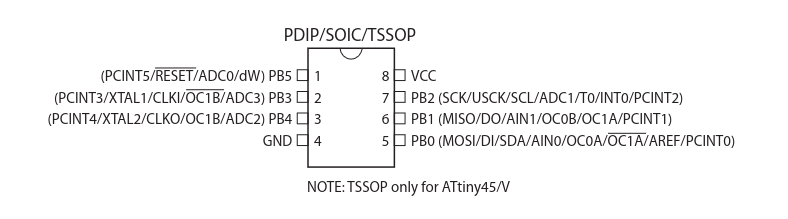
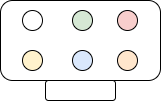

# Project notes

## ATTiny85

### Pinout
<p align='center'>
    
</p>


## ISP

### ISP Pinout
The used pinout for the ISP connector

<p align='center'>
    
</p>

The connector is positioned with the notch to the bottom, as shown in the image. Rows are identified from top to bottom with a letter (A to B) and columns are identified by a number from left to right (1-3):


| **Identifier** | **Jumper color** | **Pin** |
|----------------|------------------|---------|
| 1A | WHITE | GND | 
| 1B | GREEN | MOSI | 
| 1C | RED | VCC | 
| 2A | YELLOW | RST | 
| 2B | BLUE | SCK | 
| 2C | ORANGE | MISO |

### Connecting the ISP to the ATTiny85 chip

<p align='center'>
    
</p>


## Programming the IC

This part is mainly taken from a [medium article](https://medium.com/@ppatil/avr-programing-using-avrdude-in-ubuntu-93734c26ad19). 


### Verify the ISP connection to the IC

To verify the device signature:

```
sudo avrdude -c usbtiny -p t85
```

- `-c` indicates the programmer, in this case, the `usbtiny`.
- `-p` indicates the AVR-device. 


### Compiling the C code 

This is mainly taken from the [Arch/Wiki](https://wiki.archlinux.org/title/AVR).

#### 1. Generating the ELF file

The C code needs to be compiled into an ELF file. In the following example, the blinking demo code `demo.c` is outputed as an ELF file `demo.elf`:

```
avr-gcc -DF_CPU=8000000UL -mmcu=attiny85 -std=gnu99 demo.c -o demo.elf
```

**Maybe DF_CPU flag can be omitted when defined on the header file?**
**The same for mmcu?**

This aparently also works:
```
avr-gcc -std=gnu99 demo.c -o demo.elf
```

#### 2. Convert it to HEX (Optional)

**Aparently this step is optional?**

```
avr-objcopy -O ihex -j .text -j .data demo.elf demo.hex
```

#### 3. Write the program to the IC

```
avrdude -p t85 -c usbtiny -B 125kHz -U flash:w:demo.elf
```